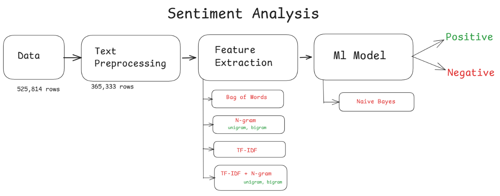
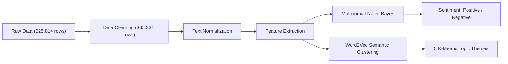

# Amazon Fine Food Reviews: Sentiment Analysis & Semantic Clustering

An end-to-end Natural Language Processing (NLP) system designed to clean, preprocess, vectorize, classify, and cluster over 500,000 Amazon food reviews.

---

## Architecture Overview

The system pipeline processes raw customer feedback through cleaning, linguistic normalization, feature extraction, probabilistic classification, and dense vector semantic clustering.



*Architectural Diagram: [architecture.png](file:///D:/nxtwave/NLP/amazon_food_review_sentimental_analysis/architecture/architecture.png)*



---

## Pipeline Stages & Documentation Directory

| Stage | Notebook (Production Code) | Technical Documentation | Core Techniques |
| :--- | :--- | :--- | :--- |
| **1. Dataset Cleaning** | [`1_cleaning.ipynb`](file:///D:/nxtwave/NLP/amazon_food_review_sentimental_analysis/code/1_cleaning.ipynb) | [`01_dataset_cleaning.md`](file:///D:/nxtwave/NLP/amazon_food_review_sentimental_analysis/documentation/01_dataset_cleaning.md) | SQLite ingestion, Score 3 removal, deduplication, helpfulness validation |
| **2. Text Preprocessing** | [`2_text_prerprossing_prod.ipynb`](file:///D:/nxtwave/NLP/amazon_food_review_sentimental_analysis/code/2_text_prerprossing_prod.ipynb) | [`02_text_preprocessing.md`](file:///D:/nxtwave/NLP/amazon_food_review_sentimental_analysis/documentation/02_text_preprocessing.md) | BeautifulSoup tag stripping, regex decontraction, stopword removal, stemming vs lemmatization, Word Clouds |
| **3. Feature Extraction** | [`3_feature_extraction_prod.ipynb`](file:///D:/nxtwave/NLP/amazon_food_review_sentimental_analysis/code/3_feature_extraction_prod.ipynb) | [`03_feature_extraction.md`](file:///D:/nxtwave/NLP/amazon_food_review_sentimental_analysis/documentation/03_feature_extraction.md) | Bag-of-Words (CSR matrix), N-grams (1, 2), TF-IDF weighted Word Clouds, Bigram bar charts, sparsity heatmaps |
| **4. Classification Model** | [`4_model_building_naive_bayes_classifier_prod.ipynb`](file:///D:/nxtwave/NLP/amazon_food_review_sentimental_analysis/code/4_model_building_naive_bayes_classifier_prod.ipynb) | [`04_model_building_naive_bayes.md`](file:///D:/nxtwave/NLP/amazon_food_review_sentimental_analysis/documentation/04_model_building_naive_bayes.md) | Stratified 80/20 train/test split, TF-IDF unigram + bigram vectorizer, Multinomial Naive Bayes, confusion matrix heatmap |
| **5. Semantic Clustering** | [`5_similarity_and_clustering_prod.ipynb`](file:///D:/nxtwave/NLP/amazon_food_review_sentimental_analysis/code/5_similarity_and_clustering_prod.ipynb) | [`05_similarity_and_clustering.md`](file:///D:/nxtwave/NLP/amazon_food_review_sentimental_analysis/documentation/05_similarity_and_clustering.md) | Word2Vec Skip-Gram embeddings (50d), document sentence vector averaging, K-Means (k=5), Cosine Similarity search, 2D PCA |

---

## Detailed Stage Summaries

### 1. Dataset Loading and Cleaning
- **Input**: Raw SQLite database containing customer reviews.
- **Filtering**: Omitted ambiguous 3-star ratings (`Score != 3`), leaving 525,814 reviews.
- **Partitioning**: Ratings mapped to binary targets: Scores 1 and 2 to `negative`, Scores 4 and 5 to `positive`.
- **Deduplication**: Pruned redundant entries across `{'UserId', 'ProfileName', 'Time', 'Summary', 'Text'}` (525,814 -> 365,333 rows, retaining 69.48%).
- **Integrity Validation**: Filtered corrupt rows where `HelpfulnessNumerator > HelpfulnessDenominator`, producing a verified corpus of 365,331 rows.
- **Output Artifact**: [`reviews_clean_file`](file:///D:/nxtwave/NLP/amazon_food_review_sentimental_analysis/reviews_clean_file).

### 2. Text Preprocessing & Normalization
- **HTML & URL Cleansing**: BeautifulSoup removes markup tags; regex strips embedded hyperlinks.
- **Contraction Standardization**: Expanded contractions (`won't` -> `will not`, `can't` -> `can not`, `it's` -> `it is`).
- **Punctuation & Digit Filtering**: Removed non-alphabetic tokens and alphanumeric identifiers (`\S*\d\S*`).
- **Case Folding & Stopwords**: Lowercased all words and filtered NLTK English stopwords.
- **Morphological Normalization**: Compared Porter Stemmer (`studies` -> `studi`) against WordNet Lemmatizer (`studies` -> `study`).
- **Visual Validation**: Word Clouds before and after preprocessing confirmed the elimination of high-frequency noise words and the emergence of high-signal sentiment vocabulary (`flavor`, `taste`, `coffee`, `love`).
- **Output Artifact**: [`preprocessed_reviews.csv`](file:///D:/nxtwave/NLP/amazon_food_review_sentimental_analysis/preprocessed_reviews.csv).

### 3. Feature Extraction
- **Bag of Words (BoW)**: Built a 50,000-feature vocabulary using [`CountVectorizer`](file:///D:/nxtwave/NLP/amazon_food_review_sentimental_analysis/code/3_feature_extraction_prod.ipynb), stored as a Compressed Sparse Row (CSR) matrix.
- **N-Grams**: Captured phrase context using unigrams and bigrams (`ngram_range=(1, 2)`, `min_df=10`, `max_features=5000`).
- **TF-IDF**: Weighted discriminative terms higher than common words. Evaluated across corpus with a TF-IDF weighted Word Cloud.
- **TF-IDF with Bigrams**: Extracted 8,000 unigram and bigram features. Extracted top 25 sentiment bigrams (`highly recommend`, `gluten free`, `green tea`, `not like`) and verified matrix sparsity via a 120x120 slice heatmap.

### 4. Machine Learning Classification (Naive Bayes)
- **Train / Test Partition**: Stratified split of 365,331 reviews (80% train: 292,264; 20% test: 73,067).
- **Leakage Prevention**: TF-IDF vectorizer fit strictly on `X_train` and applied to `X_test`.
- **Model**: [`MultinomialNB`](file:///D:/nxtwave/NLP/amazon_food_review_sentimental_analysis/code/4_model_building_naive_bayes_classifier_prod.ipynb).
- **Performance**:
  - **Accuracy**: **90.10%**
  - **Confusion Matrix**: True Negatives = 4,727; False Positives = 6,746; False Negatives = 484; True Positives = 61,110
  - **Negative Class**: Precision = 0.91, Recall = 0.41, F1-Score = 0.57
  - **Positive Class**: Precision = 0.90, Recall = 0.99, F1-Score = 0.94
- **Real-World Inference**: Tested on 5 unseen user reviews with accurate classification of positive and negative statements.

### 5. Semantic Similarity & Thematic Clustering
- **Word2Vec Training**: Skip-Gram model (`vector_size=50`, `window=5`, `min_count=3`, `workers=4`, `sg=1`) trained over tokenized reviews.
- **Review Vector Aggregation**: Averaged word embeddings across each review to create a dense 50-dimensional sentence vector matrix `(294156, 50)`.
- **K-Means Clustering**: Partitioned reviews into $k=5$ distinct thematic feedback clusters.
- **Cosine Similarity Retrieval**: Enabled vector-based retrieval of semantically identical reviews, achieving similarity scores up to 0.970.
- **2D Dimensionality Reduction**: Projected 10,000 review vectors into 2D space using [`PCA`](file:///D:/nxtwave/NLP/amazon_food_review_sentimental_analysis/code/5_similarity_and_clustering_prod.ipynb) and visualized clusters via a Seaborn scatter plot.

---

## Directory Structure

```
amazon_food_review_sentimental_analysis/
│
├── architecture/
│   └── architecture.png
│
├── documentation/
│   ├── 01_dataset_cleaning.md
│   ├── 02_text_preprocessing.md
│   ├── 03_feature_extraction.md
│   ├── 04_model_building_naive_bayes.md
│   └── 05_similarity_and_clustering.md
│
├── code/
│   ├── 1_cleaning.ipynb
│   ├── 2_text_prerprossing_prod.ipynb
│   ├── 3_feature_extraction_prod.ipynb
│   ├── 4_model_building_naive_bayes_classifier_prod.ipynb
│   ├── 5_similarity_and_clustering_prod.ipynb
│   ├── database.sqlite
│   └── preprocessed_reviews.csv
│
├── reviews_clean_file
└── README.md
```

---

## Quickstart

```python
import pandas as pd
from sklearn.feature_extraction.text import TfidfVectorizer
from sklearn.naive_bayes import MultinomialNB

df = pd.read_csv("preprocessed_reviews.csv")
X = df["CleanedText"].fillna("").astype(str)
y = df["Score"]

vectorizer = TfidfVectorizer(max_features=8000, ngram_range=(1, 2))
X_tfidf = vectorizer.fit_transform(X)

model = MultinomialNB()
model.fit(X_tfidf, y)

sample = ["This tea has amazing natural flavor and fresh aroma."]
sample_tfidf = vectorizer.transform(sample)
print(model.predict(sample_tfidf))
```
